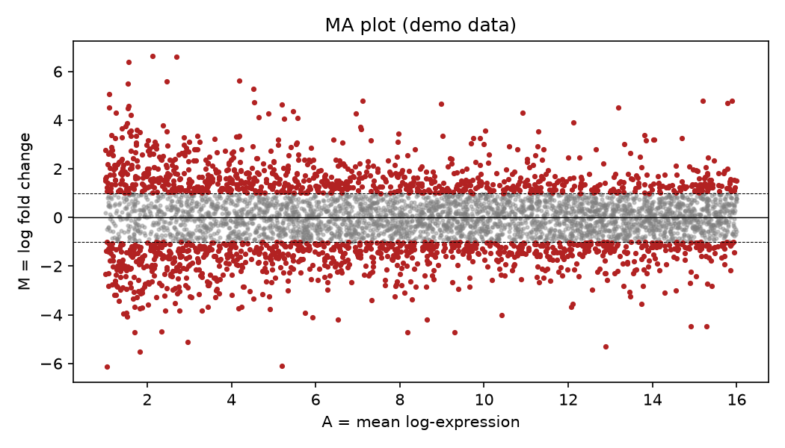

# Ma Plot Differential Expression

A volcano plot asks 'is this gene significant?' An MA plot asks a sharper question: 'are my fold changes trustworthy across the whole expression range?' The answer is often no.

## Why This Matters

Low-expression genes are noisy, and their fold changes swing wildly for statistical reasons, not biological ones. The MA plot puts mean expression on the x-axis and fold change on the y-axis, so that fan-shaped noise at low expression becomes obvious — and reminds you why shrinkage and expression filters exist.

## How It Works

1. Compute mean log-expression (A) and log fold change (M) per gene.
2. Scatter M against A.
3. Watch the spread widen at low expression, and mark the significant hits.

## What the Demo Shows



The demo simulates 5,000 genes with deliberately larger noise at low expression, plus ~150 real changes. The point cloud fans out on the left (unreliable low-expression genes) and tightens on the right — exactly the bias you filter or shrink away before trusting a fold change.

## Run It

```bash
pip install -r requirements.txt
python demo.py
```

> Demonstrated on synthetic data, so it's fully reproducible with no external downloads.
